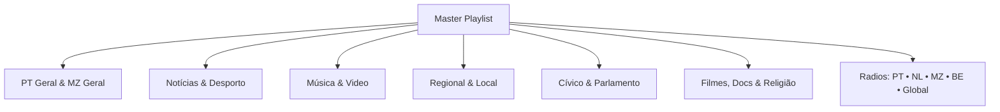

# 📺 Custom IPTV & Radio Playlists (PT • NL • MZ)

A curated, logically-grouped Free-to-Air (FTA) IPTV and Radio playlist generator tailored for a blend of **Portugal (resident)**, **Netherlands (origin)**, and **Mozambique (family/roots)**, featuring **Music TV & Visual Radio**, **Regional/Local Dialects**, and **International Gems**.

---

## 🚀 Quick Links (Use in IPTV Players)

Load these raw URLs directly into **TiviMate**, **OTT Navigator**, **Kodi**, **VLC**, or any M3U-compatible player:

| Playlist | Raw URL |
| :--- | :--- |
| **All-in-One (TV + Radio)** | `https://raw.githubusercontent.com/<username>/<repo>/main/dist/playlist.m3u8` |
| **TV Channels Only** | `https://raw.githubusercontent.com/<username>/<repo>/main/dist/tv.m3u8` |
| **Radio Channels Only** | `https://raw.githubusercontent.com/<username>/<repo>/main/dist/radio.m3u8` |
| **JSON Channel Database** | `https://raw.githubusercontent.com/<username>/<repo>/main/dist/channels.json` |
| **EPG / TV Guide (XMLTV)** | `https://raw.githubusercontent.com/LITUATUI/M3UPT/main/EPG/m3upt.xml.xz` |

---

## 📑 Logical Channel Groups

Categories use concise, universal naming for easy navigation on smart TV interfaces:



### 1. 🇵🇹 PT Geral (National Portuguese FTA)
* **Channels**: RTP 1, RTP 2, SIC, TVI, RTP Memória, RTP Madeira, RTP Açores, RTP África.
* **Stream Recipes**: Includes all `#EXTVLCOPT` Origin/Referrer headers required to stream RTP, SIC, and TVI.

### 2. 🇲🇿 MZ Geral (Mozambique FTA)
* **Channels**: TVM (Televisão de Moçambique), MNTV Moçambique, TV Vitória Moçambique.

### 3. 📰 Notícias (News)
* **Channels**: RTP 3, SIC Notícias, CNN Portugal, CNN Brasil, Euronews Português, Euronews English.

### 4. ⚽ Desporto (Sports)
* **Channels**: Canal 11, Sporting TV, A Bola TV, Real Madrid TV, FIFA+, Red Bull TV, SuperTennis, Motorvision, Nautical Channel.

### 5. 🎵 Música & Video (Music TV & Visual Studio Radio)
* **Visual Radio**: **Studio Brussel Visual** (1080p50 VRT live studio feed), **Qmusic NL Kijk Live** (1080p live studio feed).
* **Music TV Channels**: DELUXE MUSIC, DELUXE DANCE by Kontor, DELUXE RAP, Dance TV, Now 70s, Now 80s, Now Rock, Retro Music TV, 4Fun.TV, DeeJay TV, NRG 91 TV, FM Italia TV, California Music Channel, KpopTV Play.
* **Lusophone & African Music**: Trace Toca (Kizomba / Zouk / PALOP), Trace Africa, Trace Brasil, Trace Naija (Afrobeats), Trace Kitoko (Lingala / Central Africa), Trace Miziki (East Africa), Trace Urban, Trace Latina, Trace UK, Trace Gospel, XITE Hits.

### 6. 🗺️ Regional & Local (NL / PT)
* **Netherlands**: **XON (Ede TV)**, Omroep Gelderland, Omroep Brabant, Omroep West, Omroep Zeeland, Omroep Flevoland, RTV Oost, RTV Rijnmond, RTV Utrecht, RTV Drenthe, RTV Noord, L1 TV (Limburg), Omrop Fryslân (Frysk), AT5 (Amsterdam), NH Nieuws.
* **Portugal**: Porto Canal.

### 7. 🏛️ Cívico & Parlamento
* **Channels**: ARTV (Canal Parlamento PT), Tweede Kamer Plenaire zaal (NL), Tweede Kamer Troelstrazaal, Tweede Kamer Thorbeckezaal, Tweede Kamer Groen van Prinstererzaal.

### 8. 📻 Radio Bouquets

* **🇵🇹 PT Rádio**: RDP Antena 1, Antena 2, Antena 3, RDP África, Antena 1 Açores, Antena 1 Madeira, Antena 3 Madeira, Rádio Renascença, RFM, Mega Hits, Rádio Comercial, M80 Portugal, Cidade FM, Smooth FM, TSF Rádio Notícias, RUC (Universidade de Coimbra).
* **🇳🇱 NL Rádio**: NPO Radio 1, 2, 3FM, Klassiek (4), 5, FunX, NPO Blend, Radio 538, Qmusic, Radio Veronica, Sky Radio, Radio 10, Arrow Classic Rock, Sublime, BNR Nieuwsradio, KINK, Omrop Fryslân (Frysk), Gelderland Radio, L1 Radio & L1 Plat-eweg (Limburgs dialect), Omroep Brabant, Omroep West, Omroep Zeeland, Tukker FM (Twents/Nedersaksisch), Radio Continu, Gigant FM.
* **🇲🇿 MZ Rádio (National & Provincial Local Languages)**: 
  * Rádio Moçambique - Antena Nacional, RM Desporto, RM Cidade Maputo, RM Cidade Beira.
  * **Provincial / Local Languages**: RM Maputo (Changana/Ronga), RM Gaza (Changana/Chope), RM Inhambane (Gitonga/Matsua/Bitonga), RM Sofala (Sena/Ndau), RM Manica (Manyika/Ndau), RM Tete (Nyanja/Nyungwe), RM Zambézia (Elomwe/Echuwabo), RM Nampula (Emakhuwa), RM Cabo Delgado (Emakhuwa/Shimakonde/Kimwani), RM Niassa (Yao/Emakhuwa/Nyanja), LM Radio, Maputo Corridor Radio.
* **🇧🇪 BE Rádio**: Studio Brussel, StuBru De Tijdloze, MNM, Radio 1 (VRT), Klara, Classic 21 (RTBF Rock).
* **🌍 Rádio Global**: Radio Paradise (Main, Mellow, Rock, Global in Lossless FLAC), FIP + FIP Rock / Jazz / Electro / Groove, NTS Live 1 & 2, SomaFM (Groove Salad, Secret Agent, Drone Zone, Indie Pop), BBC World Service, BBC 6 Music, KEXP 90.3 FM.

---

## 🛠️ Project Structure & Maintenance

```
├── data/                       # Human-readable channel YAML definitions
│   ├── 01_generalistas.yaml
│   ├── 02_noticias.yaml
│   ├── 03_desporto.yaml
│   ├── 04_musica_tv.yaml
│   ├── 05_regional_local.yaml
│   ├── 06_filmes_docs_infantil.yaml
│   ├── 07_parlamento_civico.yaml
│   ├── 08_religiao.yaml
│   ├── 09_radio_pt.yaml
│   ├── 10_radio_nl.yaml
│   ├── 11_radio_mz.yaml
│   ├── 12_radio_be.yaml
│   └── 13_radio_internacional.yaml
├── dist/                       # Output playlists & JSON compiled by builder
│   ├── playlist.m3u8
│   ├── tv.m3u8
│   ├── radio.m3u8
│   └── channels.json
├── src/
│   ├── builder.py              # Generates dist/*.m3u8 from data/*.yaml
│   └── validator.py            # Validates stream health concurrently
└── .github/workflows/
    └── build.yml               # Automated CI build & health check
```

### Adding or Updating Channels
To add a channel or change a stream URL, simply edit the relevant file in `data/*.yaml`, for example:
```yaml
- name: Channel Name
  group: PT Geral
  tvg_id: Channel.pt@HD
  tvg_name: Channel
  logo: https://example.com/logo.png
  http_user_agent: Mozilla/5.0
  url: https://example.com/stream.m3u8
```

### Generating Playlists Locally
```bash
python3 src/builder.py
```

### Checking Stream Health
```bash
python3 src/validator.py
```
*(Use `python3 src/validator.py --all` to check all streams, including Portuguese geo-protected streams).*

---

## 📺 Note on BVN & Geo-fencing
* **BVN (Beste van NPO)** uses dynamic JWT tokens and Apple FairPlay DRM (SAMPLE-AES) on web endpoints, which cannot be decrypted directly in generic IPTV players. For Google TV / Smart TV, use the official **BVN Live** app or cast from `bvn.tv`.
* **Portuguese National Streams (RTP, SIC, TVI)**: Working stream recipes and headers are included; they play seamlessly when connected within Portugal.
